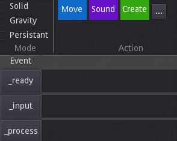

# Game-Jam-Kit (quick first draft)

Addons for jaming out games;

AssetShelf - Moving addons between projects (the idea being that 2d,3d,audio etc could be re-used as modules and keep in sync)

LemonShop - Draw in the sidebar and quickly drag sketches in as a pshysical objects without configuring nodes and collision shapes.

Deadline - Timemanagement and planing view with common aproaches as templates or something (I barely remember)

elegantGDScript - Editing scripts (?)

Paint - Draw in a bigger view with brushes that connects to pressure and/or midi signals

Drag and drop (addons/dnd) is a way of importing code snippets that can then be edited as code. 
